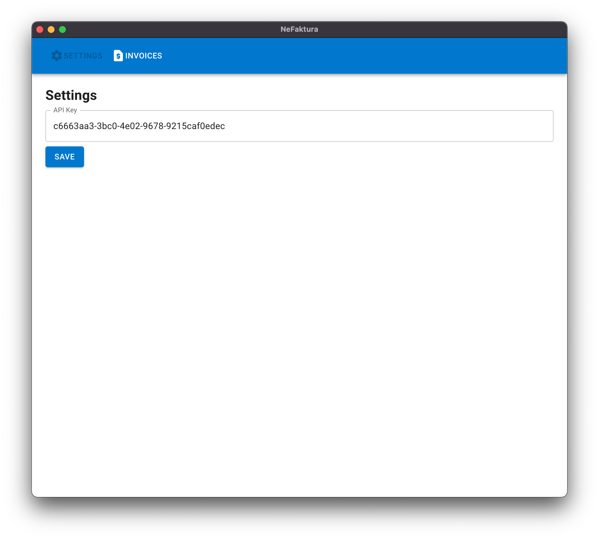
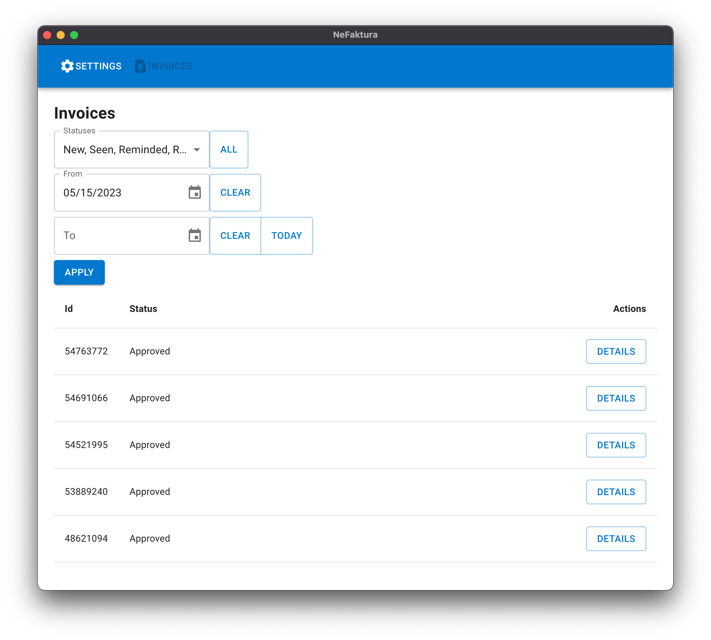
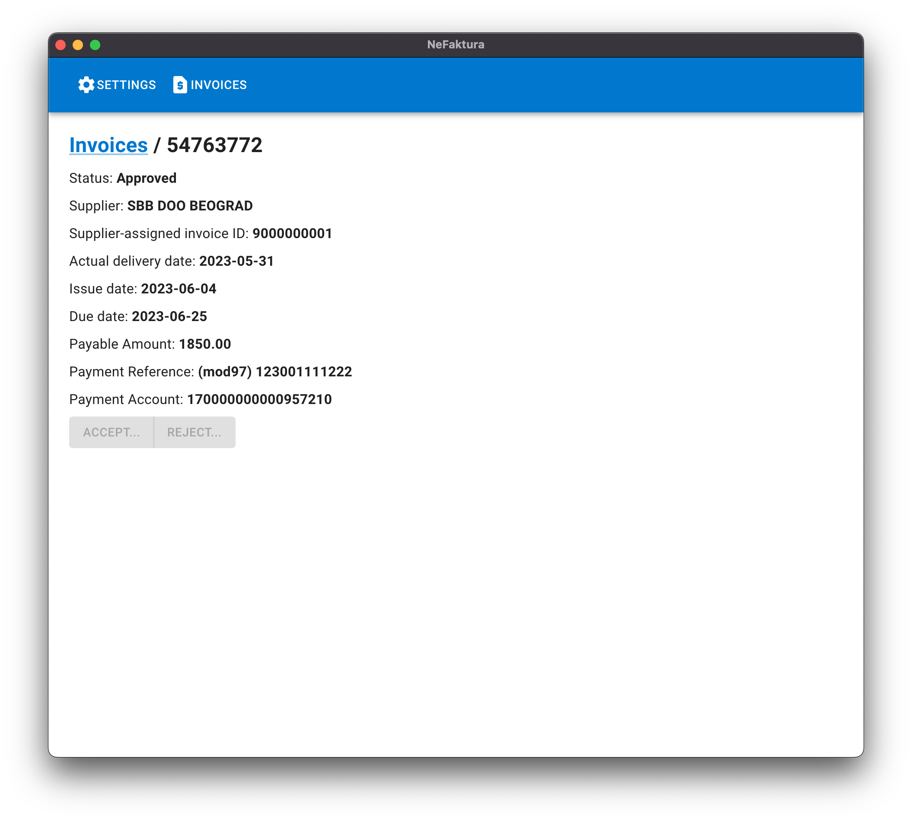
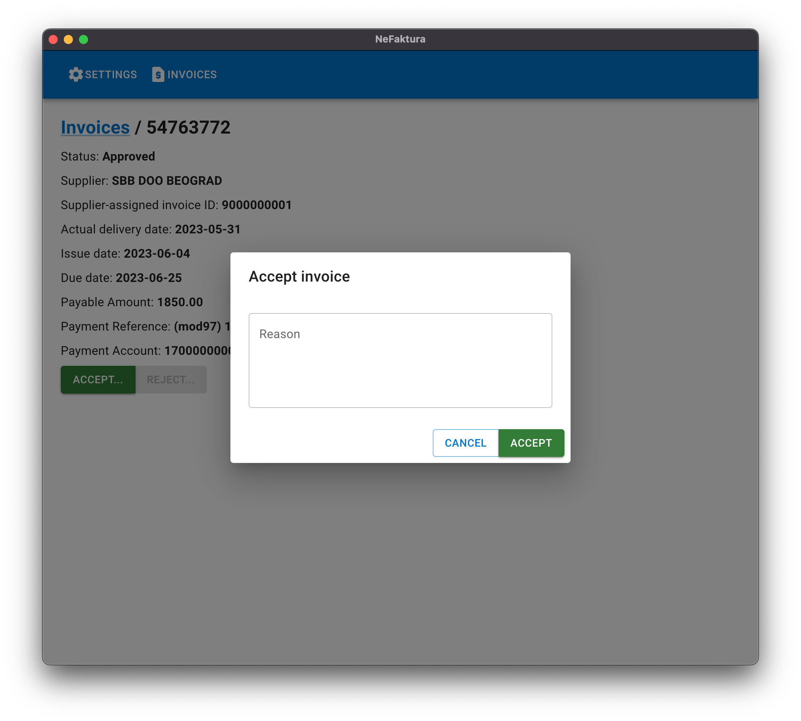

## NeFaktura

NeFaktura is a desktop application for working with purchase invoices in the Serbian national
electronic invoicing system (Sistem Elektronskih Faktura, a.k.e. eFaktura).

## Features
  - Filter purchase invoices by status and date
  - Accept or reject purchase invoices

### Platforms
  - Windows x64
  - Mac x64
  - Mac arm64 (Apple Silicon)

## User guide
- Download and install a NeFaktura binary suitable for your platform
  - If you using macOS and see an error such as "App is damaged and can't be opened", it could be because the binary is quarantined. Try opening the terminal and running a command like `xattr -d com.apple.quarantine /path/to/ne-faktura.app`.
- Open NeFaktura
- Configure API key in the settings page
  
- Select filters to search for invoices
  
- Click 'Details' to see invoice details
  
- Click 'Accept' or 'Reject' to respond to an invoice
  
